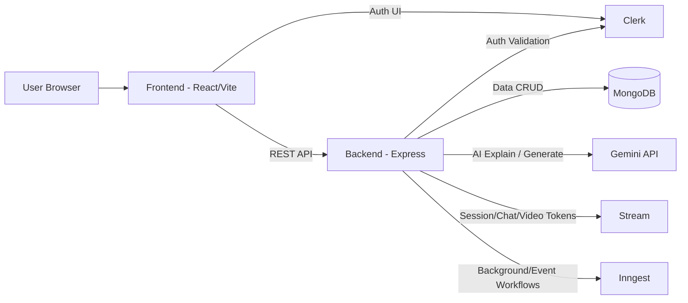

# Code Vista

Code Vista is a full-stack coding interview practice platform where users can solve DSA problems, run code in multiple languages, collaborate in live sessions, and use AI-powered assistance for explanation and code generation.

## Problem Statement

Developers preparing for coding interviews often need too many disconnected tools for:

- practicing problems,
- running multi-language code,
- collaborating with peers,
- and understanding solutions deeply.

Code Vista solves this by combining a coding playground, problem catalog, live coding sessions, and AI mentor features in one product.

## Features

- Multi-language coding playground (JavaScript, Python, Java)
- Problem list with descriptions, examples, constraints, starter code, and expected outputs
- Code execution with pass/fail feedback
- AI code explanation panel (resizable, collapsible, regenerate support)
- AI full-code generation inserted directly into editor
- Live session and collaboration features (session create/join/end + chat/video integration)
- Authentication with Clerk
- Responsive UI with panel-based workspace and output console

## 🚀 Live Demo

Try Code Vista now: **[https://code-vista-five.vercel.app/](https://code-vista-five.vercel.app/)**

No setup required! Start solving DSA problems, practice coding, and collaborate with others instantly.

## Tech Stack

### Frontend

- React 19 + Vite
- Tailwind CSS 4
- Monaco Editor
- React Router
- React Query
- Axios
- Clerk (auth)
- Stream Video/Chat SDK
- React Hot Toast

### Backend

- Node.js + Express 5
- MongoDB + Mongoose
- Clerk middleware for auth
- Inngest (background/events integration)
- Google GenAI SDK (Gemini) for AI features

### Dev Tools

- ESLint
- Nodemon

## Architecture Diagram



## Setup Instructions

### Prerequisites

- Node.js 18+ (recommended 20+)
- npm
- MongoDB instance (Atlas or local)
- Clerk account
- Stream account (for chat/video features)
- Gemini API key

### 1) Clone and Install

```bash
git clone https://github.com/sumandey2023/Code-Vista.git
cd Code-Vista

cd backend && npm install
cd ../frontend && npm install
```

### 2) Configure Environment Variables

Create a `.env` in `backend/` with:

```env
PORT=3000
MONGO_URI=your_mongodb_connection_string
CLIENT_URL=http://localhost:5173

CLERK_SECRET_KEY=your_clerk_secret_key

INNGEST_EVENT_KEY=your_inngest_event_key
INNGEST_SIGNING_KEY=your_inngest_signing_key

STREAM_API_KEY=your_stream_api_key
STREAM_API_SECRET=your_stream_api_secret

GEMINI_API_KEY=your_gemini_api_key
```

Create a `.env` in `frontend/` with:

```env
VITE_BACKEND_URL=http://localhost:3000/api
VITE_CLERK_PUBLISHABLE_KEY=your_clerk_publishable_key
VITE_STREAM_API_KEY=your_stream_api_key
```

### 3) Run the App

Backend:

```bash
cd backend
npm run dev
```

Frontend:

```bash
cd frontend
npm run dev
```

Frontend runs on `http://localhost:5173` and backend on `http://localhost:3000` by default.

## API Endpoints

Base URL: `/api`

### Health

- `GET /health` - Service health check

### Chat

- `GET /chat/token` - Get Stream token (auth required)

### Sessions

- `POST /session` - Create session (auth required)
- `GET /session/active` - Get active sessions (auth required)
- `GET /session/my-recent` - Get recent sessions for current user (auth required)
- `GET /session/:id` - Get session by ID (auth required)
- `POST /session/:id/join` - Join a session (auth required)
- `POST /session/:id/end` - End a session (auth required)

### AI

- `POST /ai/problem/explain` - Explain current code for a problem
- `POST /ai/problem/generate` - Generate full code for a problem/language

## Current Status

- AI explain and full-code generation integrated in Problem workspace
- Resizable/collapsible AI panel implemented
- Multi-language problem execution and feedback live

## License

This project currently uses the repository default license state.
